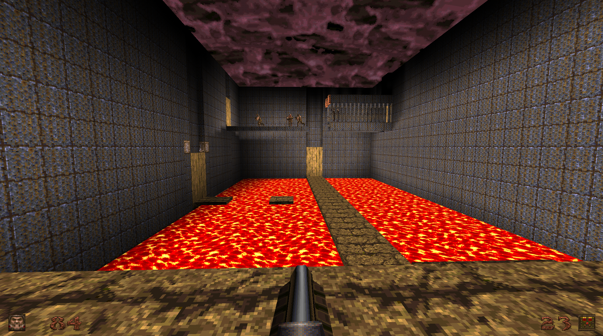

# Volcano Bunker
This repository contains my single-player Quake map for Game Design II.

## Project Description

Volcano Bunker is a single-player Quake level focused on a fun little puzzle with lava hiding a path, and combat in rooms with lava along the walls. The map was built in TrenchBroom and developed through blockout, playtesting, iteration, texturing, lighting, and final release.

## Final Release

The final `.bsp` file can be downloaded from the Releases section:

[Download the final release](https://github.com/Lemonrindstone/Quake-map-Single-Player-Lava/releases/tag/v1.0.0)

## Process Journal

My process journal and final walkthrough documentation can be found in the GitHub Wiki:

[Process Journal Wiki](https://github.com/Lemonrindstone/Quake-map-Single-Player-Lava/wiki)

## Final Walkthrough Video

[Final map walkthrough video](https://www.youtube.com/watch?v=pT3JZCya0NE)

## Thumbnail

