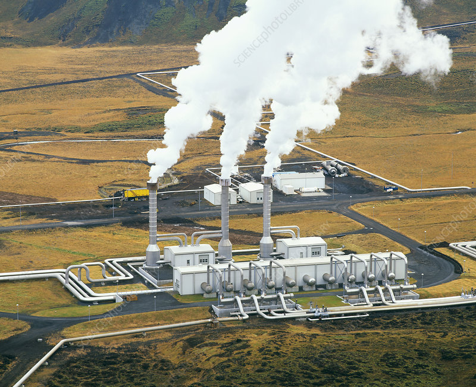
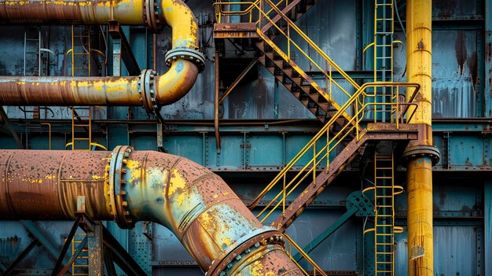
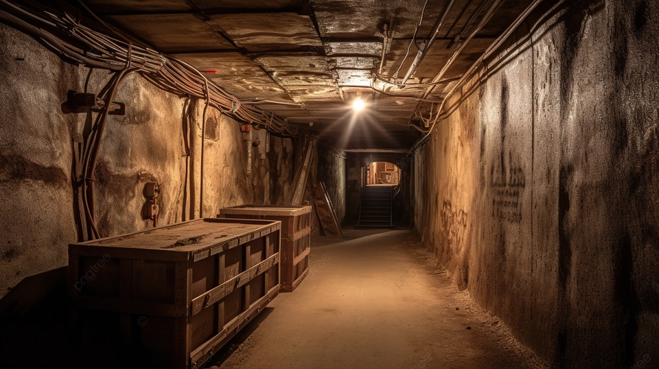
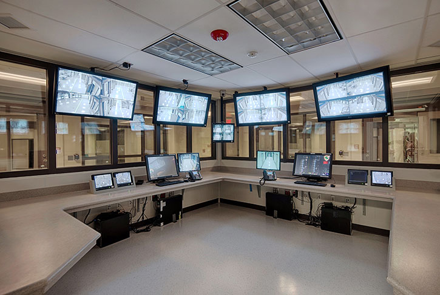
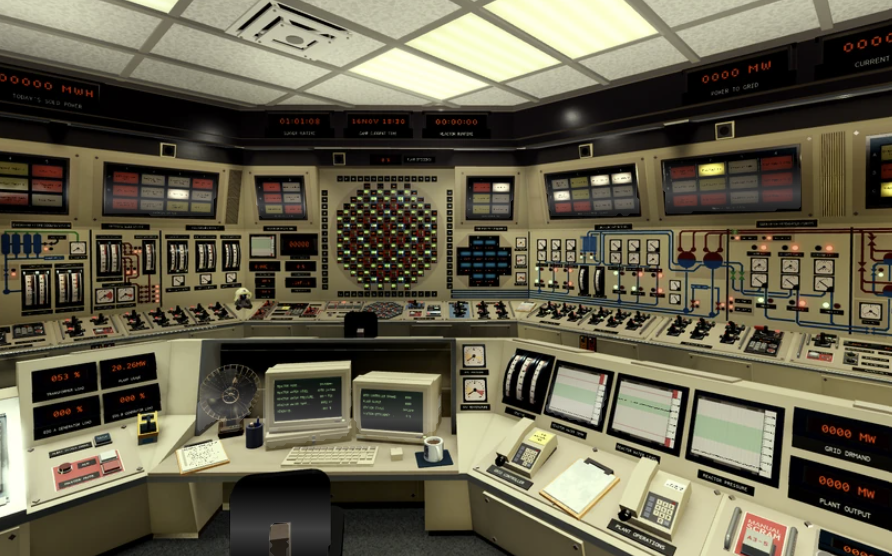
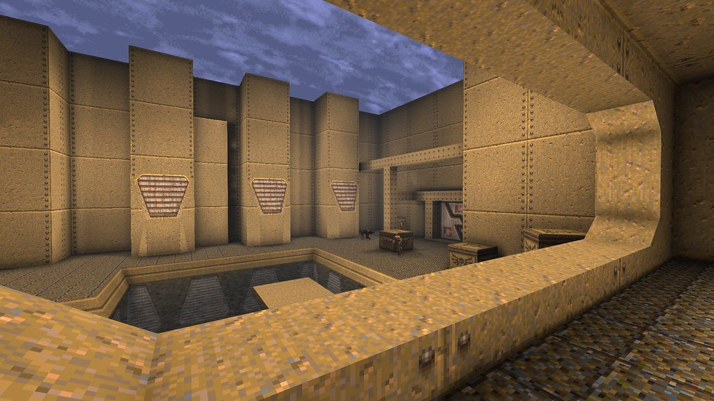
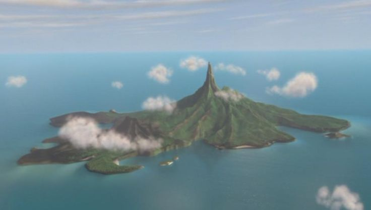
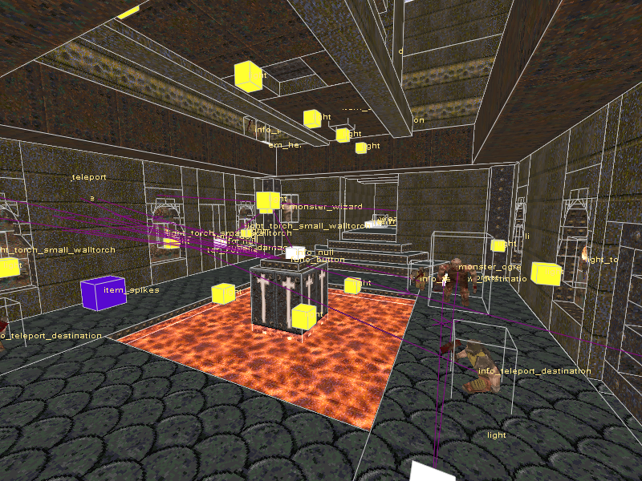
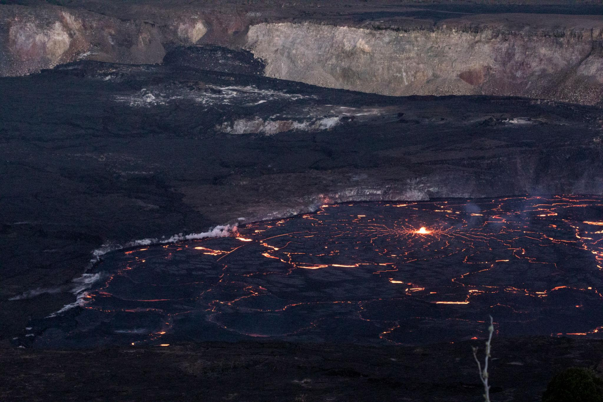
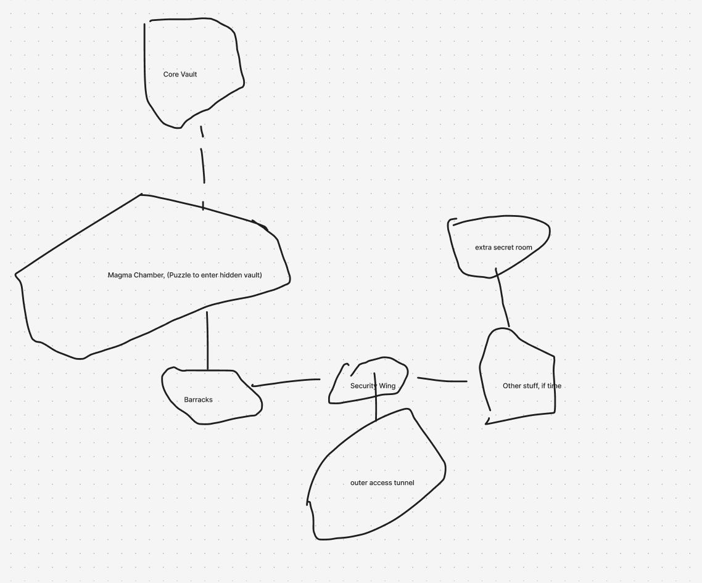

# Research and Layout

For my map, I went with the idea of a secret bunker built inside a volcano, kind of like a spy villain base. The idea is that the player is infiltrating it at first, but since it’s Quake, it turns into more combat as you go deeper. I also wanted it to feel a bit surreal instead of fully realistic, since Quake levels usually exaggerate things anyway.

The goal is to make it feel like this place actually had a purpose before the player showed up, while still having cool gameplay spaces and lava-based setpieces.

---

## Theme Goals

- Hidden bunker inside a volcano  
- Starts as infiltration, becomes combat-heavy  
- Slightly surreal / exaggerated architecture  
- Lava used as both environment and gameplay  
- Feels like a real place but still very “Quake”  

---

## Real World References

### Industrial / geothermal facilities

I looked at things like geothermal plants and industrial interiors because they deal with heat and dangerous environments. A lot of them have:

- catwalks over hazardous areas  
- pipes and machinery  
- reinforced structures  
- control rooms overlooking dangerous spaces  

This connects to my map because I want the lava areas to feel engineered, not just random.

  

---

### Bunker / military interiors

I also looked at bunker interiors and underground facilities. These helped with:

- narrow hallways  
- security checkpoints  
- thick walls and doors  
- surveillance areas  

This helps support the spy/infiltration idea and makes the early parts of the level feel more grounded.

  

---

## In-Game References

### Quake base maps

Quake’s base maps are a big reference for this since they mix industrial and abstract design. They use:

- strong shapes  
- simple layouts  
- vertical spaces  
- hazards like lava  

I want my map to feel similar in terms of readability and gameplay flow.

---

### Volcano villain base (spy theme)

I was also inspired by the idea of a classic villain base inside a volcano. These usually have:

- dramatic large rooms  
- lava used visually  
- secret entrances  
- control centers  

This helps push the map to feel more unique and not just a normal bunker.

---

## WAD Research

Since this is Quake, I looked at textures that would actually work in the engine.

I’ll probably use:

- metal panels  
- concrete walls  
- tech textures  
- warning stripes  
- lava / rock textures  

I want strong contrast between:

- bunker areas (metal/concrete)  
- volcanic areas (rock/lava)  

I found that there are some base quake WADs with lava, but I haven’t found a bunch of pictures yet, I’ll add them later.

---

## Key Reference Breakdown

### Lava control / industrial lava room

One of the main ideas for my map is a large lava room with catwalks and controls.

In this reference, I would mark:

- lava as the main hazard and focal point  
- walkways around the edges  
- control room overlooking everything  
- bridges or platforms across lava  
- large support structures  

This helps me plan the main setpiece of the level.

  

---

## Moodboard

I kinda just split the moodboard across all the sections on this document. It helps me group things a little better, hopefully thats ok.

---

## How This Research Helps My Map

This research helped me figure out what kinds of spaces should be in the map and how they connect. Instead of just making random rooms, I now have a better idea of what each area is supposed to be.

It also helped me plan where the big lava setpiece will go and how to make it feel important.

---

# Areas and Bubble Diagram

For this map, I came up with 5 main areas based on the theme of a volcano bunker. Each one has a purpose in the story and gameplay.

---

## 1. Outer Access Tunnel

### Narrative

This is the entrance to the bunker, hidden in volcanic rock. It’s meant for maintenance or secret access.

It should feel like the player is sneaking in rather than entering the main entrance.

### Gameplay

- low intensity start  
- maybe 1 small fight  
- player gets oriented  

---

## 2. Security Processing Wing

### Narrative

This is where people would normally be checked and monitored. It includes security and surveillance.

It helps show that this was a controlled and guarded space.

### Gameplay

- first real combat encounter  
- enemies behind windows or corners  
- simple switch or key to progress  

---

## 3. Barracks and Mess Hall

### Narrative

This is where people lived and ate. This is important because it makes the base feel real.

Includes:

- beds  
- tables  
- storage  
- bathroom  

(This is the “where is the toilet” part)

### Gameplay

- tighter combat  
- enemies in rooms  
- maybe a short quiet section  

---

## 4. Magma Control Chamber

### Narrative

This is the main feature of the level. It’s a large room built around lava with machinery and walkways.

This is where the base starts to feel more extreme and less realistic.

### Gameplay

- major setpiece  
- enemies on catwalks  
- vertical combat  

### Lava Puzzle Idea

The player sees a path or hatch under lava.

They:

- fight through side areas  
- activate a switch  
- lava lowers or opens  
- path is revealed  

(This is simple enough to work in Quake and still feels cool)

---

## 5. Core Vault / Escape Shaft

### Narrative

This is the deepest part of the bunker. It’s what everything was protecting.

It could be:

- reactor  
- control core  
- secret vault  

### Gameplay

- final fight  
- multiple enemy types  
- more intense than earlier areas  

---

## Bubble Diagram

