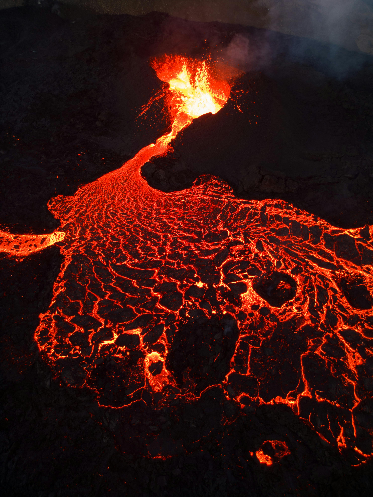
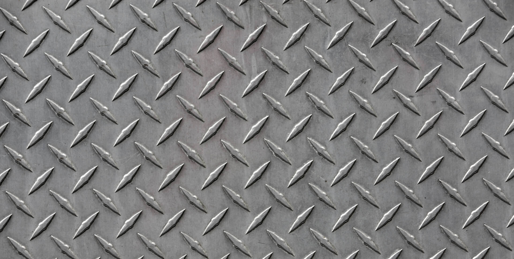
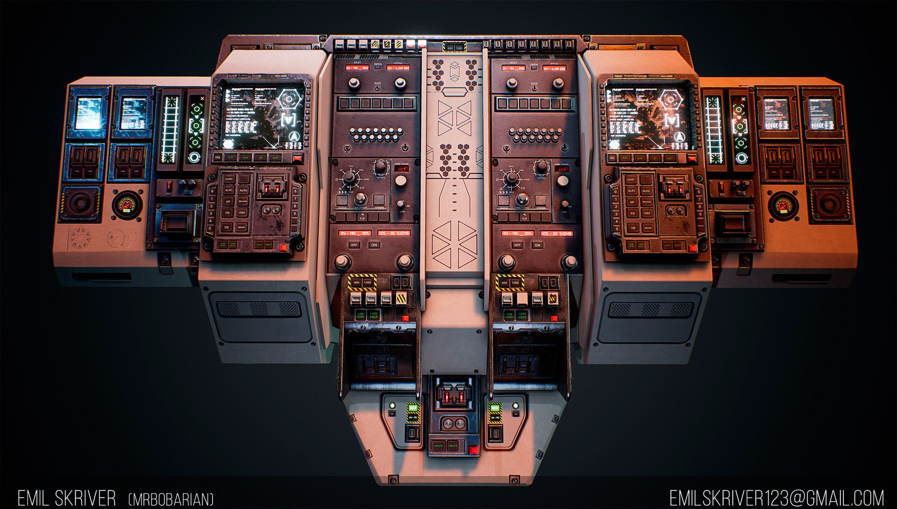

# Theme

My map is a bunker built inside a volcano with a spy / infiltration theme. The player starts by entering a hidden facility and moves deeper into a more dangerous and surreal environment centered around lava.

My first step was coming up with a theme to guide both the gameplay and the visual design. I researched Quake WADs and textures to find something that would support a mix of industrial and volcanic environments.

## Gameplay Feel

I want the player to feel tense and slightly overwhelmed at first, but more powerful as they progress deeper into the level. The lava areas are meant to feel dangerous and force movement.

## Key Textures

## Worldbuilding Questions

**Where is this place in the world?**  
A hidden underground bunker built into a volcanic region.

**What happened here recently?**  
Something went wrong and the facility has been overrun.

**What is about to happen?**  
The player is entering and triggering more chaos.

**What should the player be on the lookout for?**  
Enemies, lava hazards, and environmental traps.

**What here is powerful or valuable?**  
The core of the bunker and whatever it was built to protect.

**Who’s really in control here?**  
The enemies occupying the base.

**What here is not what it appears to be?**  
The facility seems controlled but is actually unstable.

## Design Questions

**What rooms does this area normally contain?**  
Control rooms, living quarters, security areas, and industrial spaces.

**Where is the toilet?**  
In the barracks/living quarters area.

**How do people interact with this location before the player arrives?**  
Workers and guards maintained the facility and monitored operations.

**How does it connect to other spaces?**  
Through tunnels, doors, and vertical pathways.

**What is its architectural style?**  
Industrial with exaggerated, surreal elements due to the volcanic setting.
